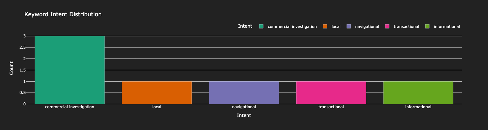
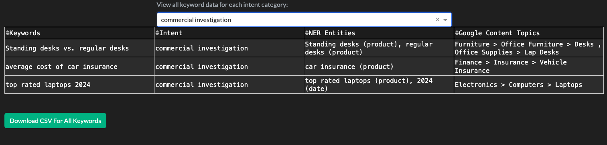

## Project Metadata

<table>
  <tr>
    <td><strong>Title</strong></td>
    <td>KeyIntentNER T</td>
  </tr>
  <tr>
    <td><strong>Emoji</strong></td>
    <td>♾️</td>
  </tr>
  <tr>
    <td><strong>Color Scheme</strong></td>
    <td>Yellow to Red</td>
  </tr>
  <tr>
    <td><strong>SDK</strong></td>
    <td>Docker</td>
  </tr>
  <tr>
    <td><strong>License</strong></td>
    <td>Apache 2.0</td>
  </tr>
  <tr>
    <td><strong>Short Description</strong></td>
    <td>Extract keyword intent, NLP entities, and Google topics</td>
  </tr>
</table>

---
# KeyIntentNER-T
KeyIntentNER-T is a tool designed for SEO and digital marketing professionals to provide valuable keyword insights. By entering a list of keywords, you can gain insights into Keyword Intent, NLP Entities extracted via NER (Named Entity Recognition), and Topics. This tool demonstrates how modern NLP methods can be used to understand shorter text strings (keywords) in a way similar to search engines.

## Features
### Keyword Intent
A custom function that looks for the presence of specific terms in keywords and classifies them into one of six predefined intent categories:

- Informational
- Navigational
- Local
- Commercial Investigation
- Transactional
- Other

### NLP Entities
Utilizes GLiNER, an advanced Named Entity Recognition (NER) model, to classify shorter text strings. Entities are mapped to all entity types included in the Google Cloud Natural Language API.

### Topics
Matches keywords to topics from Google's well-known Content and Product taxonomies.

## Usage
- Enter a list of keywords (one per line, up to 100 MAX) and click the submit button. 
- Keyword processing can take anywhere from 30 seconds up to ~2 minutes due to the extensive analysis performed behind the scenes. 
- Once processing is complete, you can download any of the bar chart plots and download a CSV export with insights for all keywords.

Example keywords: 
```
Standing desks vs. regular desks
car repair service my area
Buy groceries online with delivery
average cost of car insurance
top rated laptops 2024
Book a flight to Hawaii
Where are some good places to hike near me?
```

#### Example Plot


#### Example Table


## Benefits for SEO
Improved content strategy by focusing your SEO efforts on creating more relevant/helpful content that addresses the search intent for keywords.

### Enhanced Keyword Targeting
Match keywords to Google's well-known categories, ensuring your content is aligned with popular search themes.

### Better Understanding of User Intent
Gain insights into what kind of information a person is looking for and how keywords can be interpreted by search engines.

### Notes on Data:
- GLiNER Model [gliner_small-v2.1](https://huggingface.co/urchade/gliner_small-v2.1) was trained on the [urchade/pile-mistral-v0.1](https://huggingface.co/datasets/urchade/pile-mistral-v0.1) dataset
- Keyword Intent is determined by a custom function that looks for the presence of specific terms in keywords and classifies them into one of six predefined intent categories. The function includes popular "keyword modifiers" but a more customized list will provide better matches or using other ML tools to identify intent assignment. 
- Keyword Intent Classification is performed using a custom rule-based algorithm. This algorithm scans keywords for specific terms and patterns, categorizing them into one of six predefined intent categories. While the current implementation includes common "keyword modifiers," the accuracy can be significantly improved by:
  - Expanding and customizing the list of intent-indicating terms
  - Implementing more sophisticated machine learning models for intent recognition
- Topic Modeling uses both [Google Content Categories](https://cloud.google.com/natural-language/docs/categories) & [Google Product Taxonomy](https://www.google.com/basepages/producttype/taxonomy.en-US.txt)
- GLiNER is able to use a large set of entity types, but for the purposes of this demo it is limited to the following [Google NLP Entity Types](https://cloud.google.com/natural-language/docs/reference/rest/v2/Entity#type):

```
PERSON : "person"
LOCATION : "location"
ORGANIZATION : "organization"
EVENT : "event"
WORK_OF_ART	: "work_of_art"
CONSUMER_GOOD : "product" and "service"
OTHER	: "misc"
PHONE_NUMBER : "phone_number"
ADDRESS	: "address"
DATE	: "date"
NUMBER : "number"
PRICE : "price"
```
- Due to the limitations of hosting this in a free space, a smaller sentence transformers model is used which does not perform as well with some of the Topic Modeling categories. In testing, the [all-roberta-large-v1 model](https://huggingface.co/sentence-transformers/all-roberta-large-v1)  performed best for sample keywords tested. 
  
#### GLiNER Model Citation
- GLiNER: Generalist Model for Named Entity Recognition using Bidirectional Transformer.
- Authors: Urchade Zaratiana, Nadi Tomeh, Pierre Holat, Thierry Charnois.
- Year: 2023.
- Link: [arXiv:2311.08526](https://arxiv.org/abs/2311.08526)

For questions or if you are interested in building custom SEO dash apps, contact me at: jrad.seo@gmail.com
